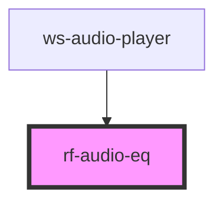

# rf-audio-eq

<!-- Auto Generated Below -->

## Properties

| Property      | Attribute      | Description | Type     | Default       |
| ------------- | -------------- | ----------- | -------- | ------------- |
| `audioSource` | `audio-source` |             | `string` | `''`          |
| `color`       | `color`        |             | `string` | `'limegreen'` |

## Dependencies

### Used by

 - [ws-audio-player](../ws-audio-player)

### Graph

----------------------------------------------

*Built with [StencilJS](https://stenciljs.com/)*
