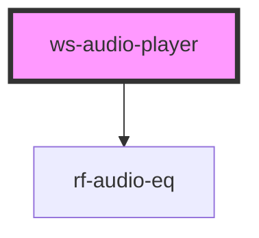

# ws-audio-player

<!-- Auto Generated Below -->

## Properties

| Property                      | Attribute                       | Description                                                      | Type     | Default     |
| ----------------------------- | ------------------------------- | ---------------------------------------------------------------- | -------- | ----------- |
| `audio`                       | `audio`                         | The Link To The Audio File                                       | `string` | `undefined` |
| `color`                       | `color`                         | The waveform color                                               | `string` | `undefined` |
| `duration`                    | `duration`                      |                                                                  | `string` | `undefined` |
| `externalVisualizer`          | `external-visualizer`           | optional external Visualizer Web Component /: Component tag name | `string` | `undefined` |
| `externalVisualizerContainer` | `external-visualizer-container` | optional external Visualizer Container :  element selector       | `string` | `undefined` |
| `height`                      | `height`                        | The height of the waveform                                       | `string` | `undefined` |
| `progressColor`               | `progress-color`                | The waveform color                                               | `string` | `undefined` |
| `theme`                       | `theme`                         | The player theme                                                 | `string` | `undefined` |
| `trackTitle`                  | `track-title`                   | The Track Title                                                  | `string` | `undefined` |

## Methods

### `create() => Promise<void>`

#### Returns

Type: `Promise<void>`

### `playpause() => Promise<boolean>`

#### Returns

Type: `Promise<boolean>`

## Dependencies

### Depends on

- [rf-audio-eq](../rf-audio-eq)

### Graph

----------------------------------------------

*Built with [StencilJS](https://stenciljs.com/)*
